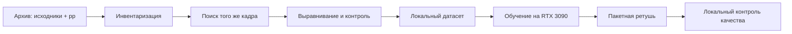

# AutoRetush

Локальный конвейер пакетной портретной ретуши, который учится на собственных парах «исходный кадр → готовая ретушь» и работает на одной NVIDIA RTX 3090 (24 ГБ).

> Репозиторий публичный, а данные — нет. Здесь не должно быть исходных фотографий, лиц, путей к архиву, манифестов, весов, чекпойнтов, превью или готовых результатов. Ядро продукта и обученные модели рекомендуется хранить в отдельном приватном репозитории.

## Что строим

Система не генерирует новое лицо и не устанавливает личность человека. Она:

1. находит один и тот же **кадр** до и после ретуши по геометрии всего изображения;
2. выравнивает пары и отбраковывает несовпадающие снимки;
3. локально выделяет лицо и его зоны без создания идентификатора личности;
4. учится повторять глобальный цвет, локальные тоновые правки и аккуратную работу с текстурой;
5. обрабатывает новые фотографии пакетно и сохраняет отчёт контроля качества.



## Текущий этап

Этап 0 перешёл от калибровки к полному возобновляемому проходу по 458 выбранным
детским группам (157/187/114 по трём сезонам). В ручной выборке оператор подтвердил
все 200 из 200 строгих `accepted`-кандидатов: point precision составила 100%, точная
95%-я нижняя граница — около 98,17%. Итоговое число пар будет зафиксировано только
после завершения и проверки полного прохода.

## Карта документации

- [Архитектура](docs/ARCHITECTURE.md) — слои системы и рекомендуемая модель.
- [Карта проекта](docs/PROJECT_MAP.md) — публичные и приватные части.
- [Подготовка датасета](docs/DATASET.md) — правила пар, выравнивания и разбиения.
- [Дорожная карта](docs/ROADMAP.md) — путь от инвентаризации до пакетного приложения.
- [Безопасность](docs/SECURITY.md) — что никогда не попадает в GitHub.
- [Сводка инвентаризации](docs/INVENTORY_SUMMARY.md) — только агрегированные числа без путей и имён.
- [Реестр сторонних моделей](docs/THIRD_PARTY_MODELS.md) — кандидаты и проверки лицензий.

## Быстрый старт (после этапа инвентаризации)

```powershell
py -3.11 -m venv .venv
.venv\Scripts\Activate.ps1
python -m pip install -e ".[dev]"
autoretush --help
```

Локальный конфиг создаётся копированием `configs/local.example.yaml`; файл `configs/local.yaml` игнорируется Git. Команды подготовки данных по умолчанию работают в режиме отчёта и не меняют архив.

## Защита разработки

Публичный GitHub технически не может скрыть опубликованный код. Поэтому репозиторий задуман как публичная оболочка: документация, безопасные интерфейсы и общие инструменты контроля. Собственные обучающие рецепты, параметры ретуши, веса и рабочее приложение должны находиться только локально или в приватном репозитории. Отсутствие открытой лицензии означает, что права на код не передаются автоматически, но не делает опубликованный исходник секретным.

Репозиторий опубликован на условиях [All Rights Reserved](LICENSE): открытая лицензия на
копирование, изменение и распространение не предоставляется. Это юридическая граница,
а не техническое сокрытие уже опубликованного текста.

## Проверенный статус

Текущие результаты, реальные границы инвентаризации и список следующих контрольных
точек собраны в [статусе реализации](docs/IMPLEMENTATION_STATUS.md). Ручная калибровка
завершена; полный возобновляемый проход выбранных детских групп уже идёт.
