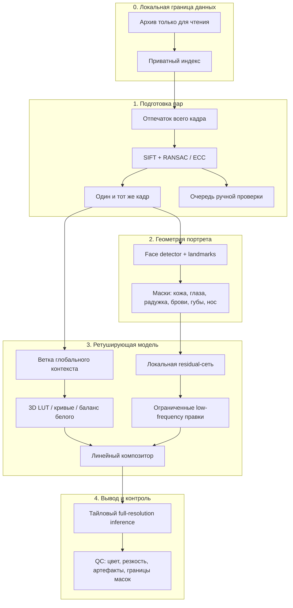

# Архитектура AutoRetush

## Главный принцип

Ретушь должна быть предсказуемой и сохранять реальную внешность. Поэтому базовая версия не использует diffusion/GAN для перерисовки лица. Модель предсказывает ограниченные цветовые преобразования, мягкие локальные поправки и маски, а исходная высокочастотная текстура остаётся основой результата.

## Слои системы

### Слой 0 — локальная граница

- Архив на диске E открывается только на чтение.
- Индексы, абсолютные пути, превью, манифесты и результаты живут вне Git-репозитория.
- Материализация датасета выполняется копированием после оценки свободного места; исходники не перемещаются.
- В публичных логах используются псевдонимные `group_id` и `pair_id`, а не названия школ, садов или файлов.

### Слой 1 — подготовка пар

Пара считается годной только тогда, когда это один и тот же момент съёмки до и после обработки. Последовательность:

1. поиск каждой папки `pp` и соседних исходных изображений;
2. устойчивый perceptual hash всего изображения для короткого списка;
3. сопоставление локальных точек SIFT;
4. RANSAC-гомография, проверка числа совпадений, покрытия кадра и ошибки;
5. ECC/edge-проверка после выравнивания;
6. one-to-one назначение пар внутри одной рабочей папки;
7. строгие совпадения принимаются, пограничные показываются человеку, остальные исключаются.

Этот слой не строит embedding лица и не отвечает на вопрос о личности. Более того, разные кадры одного человека намеренно не принимаются: они не подходят для paired supervised learning.

### Слой 2 — геометрия лица без идентификации

Базовый кандидат — MediaPipe Face Landmarker: локальная обработка, 478 landmarks, включая контуры радужек, blendshapes и матрицу положения лица. Официальная model card отдельно отмечает, что эти landmarks не создают уникального представления лица и не предназначены для идентификации. Из контуров строятся мягкие маски зон. Для сложных границ (волосы, очки, перекрытия) можно подключить SAM 2 как уточняющий сегментатор по подсказкам от landmarks. Любые веса сначала проходят отдельную проверку лицензии.

Выход слоя — только геометрия текущего кадра: координаты и маски. Постоянные шаблоны личности и поиск одного человека в архиве не используются.

### Слой 3 — модель ретуши

Рекомендуемая архитектура — гибрид из трёх веток:

1. **Global context encoder** получает уменьшенную копию кадра (например, 512–768 px) и выбирает смесь нескольких 3D LUT, экспозицию, баланс белого и мягкие RGB/Lab-кривые.
2. **Local residual network** на базе компактного NAFNet width-32 получает линейный RGB, карты зон и глобальный контекст. Она предсказывает ограниченные `Δlow`, `Δtexture`, `Δparts` и коэффициент локального смешивания, а не новое изображение целиком. Архитектура обучается с нуля на собственных парах.
3. **Texture-preserving compositor** разделяет частоты (Laplacian/bilateral pyramid), применяет правку преимущественно к низким и средним частотам и возвращает исходную микротекстуру. Сила каждого канала ограничена конфигом.

Почему так: 3D LUT быстро и хорошо воспроизводит общий стиль, локальная ветка повторяет характерные правки ретушёра, а детерминированный композитор снижает риск «пластика», новых деталей и изменения внешности.

### Слой 4 — full-resolution вывод

- Глобальные параметры вычисляются один раз на уменьшенной копии.
- Локальная ветка работает тайлами 768–1024 px с перекрытием 96–160 px и cosine blending.
- Цвет считается в linear RGB; Lab используется только для части потерь и метрик.
- Результат сохраняется в 16-bit TIFF/PNG для проверки либо JPEG с заданным профилем для рабочего экспорта.
- До пакетного экспорта проверяются клиппинг, цветовой сдвиг, резкость глаз, halo по маскам и максимальная величина residual.

## Обучение на RTX 3090 24 ГБ

### Этап A — глобальный стиль

- вход 512–768 px;
- 3D LUT 33³ или смесь 3–5 LUT;
- batch 8–16 ориентировочно;
- losses: Charbonnier/L1, Lab/Delta-E proxy, histogram/curve smoothness, LUT monotonicity и total variation.

### Этап B — локальные правки

- crops 768–1024 px вокруг портрета и случайные контекстные crops;
- batch 2–4, gradient accumulation до эффективного 8–16;
- FP16 AMP с `torch.amp.autocast("cuda")` и `GradScaler`;
- losses: masked Charbonnier, MS-SSIM, gradient/detail preservation, residual magnitude, mask smoothness.

### Этап C — совместная тонкая настройка

- заморозить часть global encoder на первых эпохах;
- затем малый learning rate для всех веток;
- early stopping по отдельным школам/сезонам, а не по случайным изображениям;
- никакого adversarial loss в MVP.

Ориентир для 3090: начать с crop 768, batch 2, AMP, accumulation 4; после реального замера увеличивать crop или batch. Точное значение зависит от числа каналов масок и ширины U-Net.

## Потери и метрики

Общая функция:

`L = λ1·L_charb + λ2·L_ms-ssim + λ3·L_lab + λ4·L_gradient + λ5·L_residual + λ6·L_mask`

- `L_charb` — точность по пикселям на валидной области выровненной пары;
- `L_ms-ssim` — структура на нескольких масштабах;
- `L_lab` — цвет и тон;
- `L_gradient` — сохранение волос, ресниц, ткани и микротекстуры;
- `L_residual` — штраф за ненужное сильное изменение;
- `L_mask` — плавность и отсутствие швов.

Основные метрики: PSNR/SSIM по всему кадру, Delta-E по коже/фону, LPIPS только как вспомогательная perceptual-метрика, клиппинг, sharpness ratio и ручная слепая A/B-оценка. LPIPS не используется для установления личности.

## Почему не одна большая генеративная сеть

- она легче меняет реальные черты и текстуру;
- требует больше памяти и данных;
- хуже объясняет, какая стадия дала ошибку;
- сложнее обеспечить повторяемость на 12–30 Мп;
- для серийной школьной фотографии важнее стабильность, чем творческая генерация.

## Ссылки на первичные источники

- [MediaPipe](https://github.com/google-ai-edge/mediapipe) — локальные vision tasks, Apache-2.0.
- [MediaPipe Face Landmarker API](https://ai.google.dev/edge/api/mediapipe/python/mp/tasks/vision/FaceLandmarker) — landmarks на изображениях.
- [MediaPipe Face Mesh model card](https://storage.googleapis.com/mediapipe-assets/Model%20Card%20MediaPipe%20Face%20Mesh%20V2.pdf) — 478 landmarks и ограничения модели.
- [Deep Bilateral Learning / HDRNet](https://groups.csail.mit.edu/graphics/hdrnet/) — быстрые локальные affine-преобразования.
- [Image-Adaptive 3D LUT](https://github.com/HuiZeng/Image-Adaptive-3DLUT) — full-resolution photo enhancement, Apache-2.0.
- [NAFNet](https://github.com/megvii-research/NAFNet) — экономная residual-архитектура, MIT.
- [DeepLPF](https://github.com/sjmoran/deeplpf-image-enhancement) — интерпретируемые локальные фильтры, BSD-3-Clause.
- [SAM 2](https://github.com/facebookresearch/sam2) — опциональное уточнение масок, Apache-2.0 для репозитория; условия конкретных чекпойнтов проверяются отдельно.
- [PyTorch AMP](https://docs.pytorch.org/docs/stable/amp.html) — актуальный API смешанной точности.
